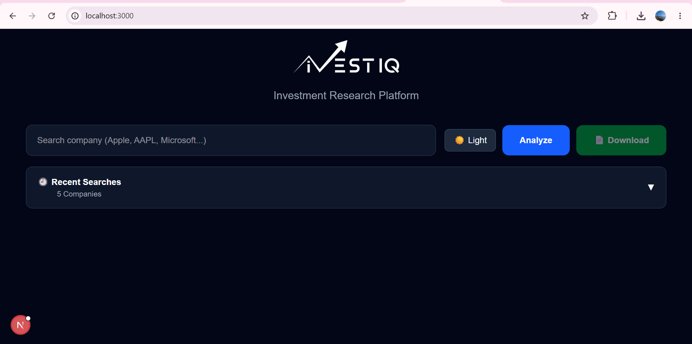
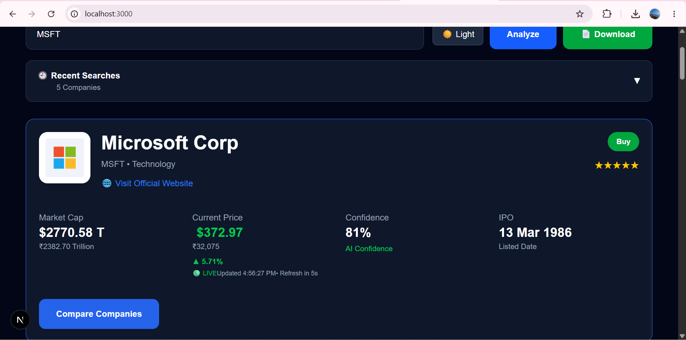
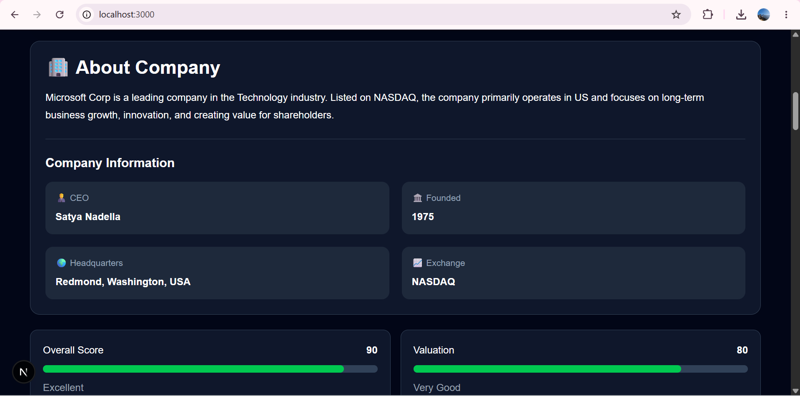
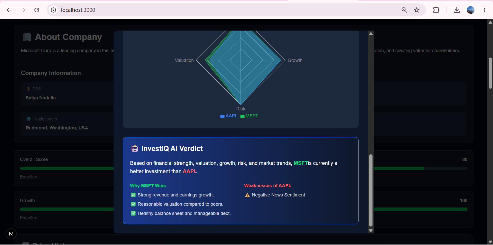
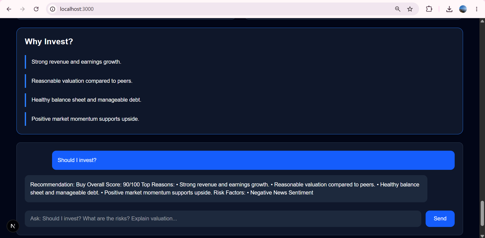
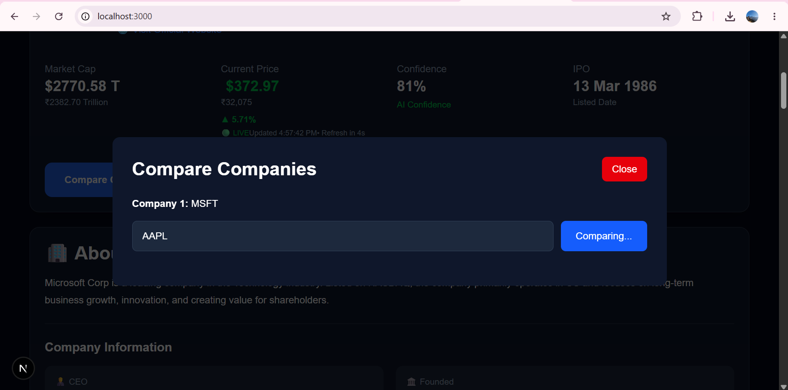
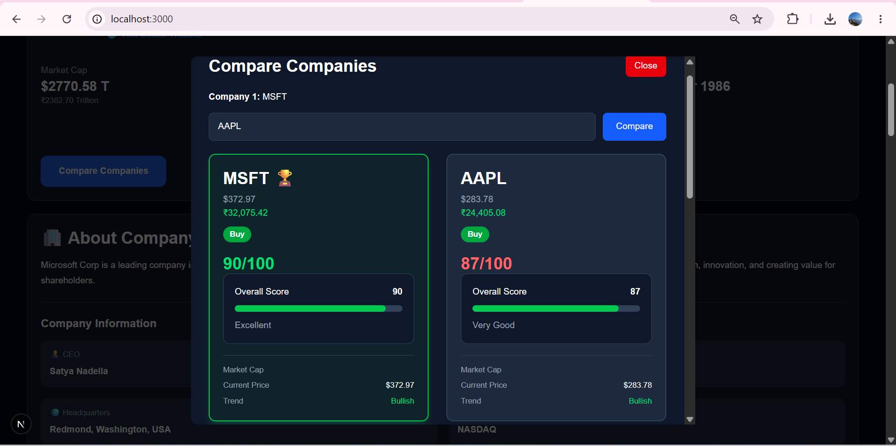
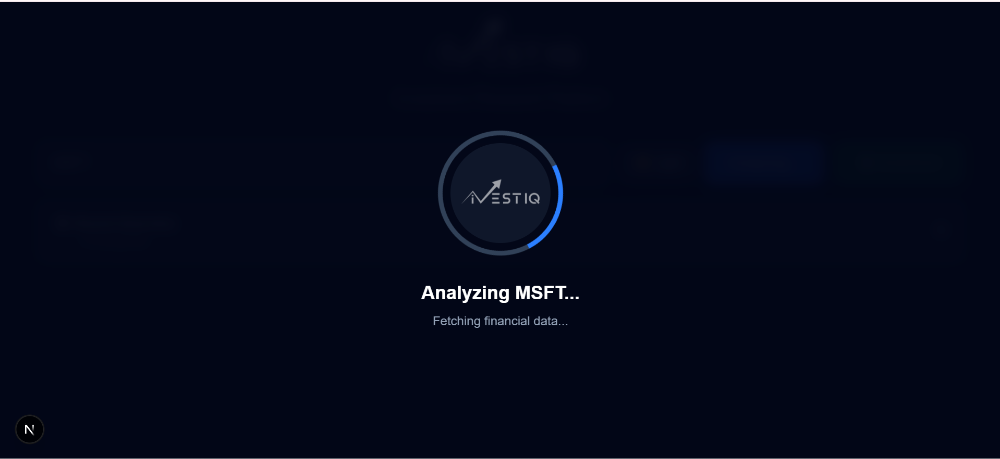

<p align="center">
  
</p>


<p align="center">

AI-Powered Investment Research Platform

Built using Next.js • TypeScript • Tailwind CSS • Finnhub API

</p>

---

# 🚀 Overview

InvestIQ is a modern AI-powered Investment Research Platform designed to help investors analyze publicly listed companies using financial data, company fundamentals, market trends, historical prices, news sentiment, and intelligent investment recommendations.

Instead of manually browsing multiple websites, InvestIQ combines all important investment information into one beautiful dashboard and generates an overall recommendation with confidence score.

---

# ✨ Features

## 📊 Company Analysis

- Company Overview
- Company Profile
- CEO Information
- Headquarters
- IPO Details
- Exchange Information
- Currency Information

---

## 📈 Financial Analysis

- Market Capitalization
- Current Stock Price
- Overall Financial Score
- Financial Health
- AI Confidence Score

---

## 📉 Market Analysis

- Historical Price Charts
- Live Price Updates
- USD & INR Conversion
- Market Trend Analysis

---

## 📰 News Analysis

- Latest Company News
- News Sentiment Analysis
- Positive / Negative / Neutral Articles
- AI News Score

---

## 🤖 AI Investment Recommendation

- Strong Buy
- Buy
- Hold
- Watch
- Avoid

Generated using multiple intelligent analysis modules.

---

## 📊 Company Comparison

- Compare Two Companies
- Overall Score Comparison
- AI Winner Detection
- USD & INR Price Comparison

---

## 🎨 User Experience

- Dark Theme
- Light Theme
- Live Search Suggestions
- Search History
- Beautiful Loading Animation
- Responsive UI
- Modern Dashboard

---

# 🛠 Tech Stack

| Technology | Purpose |
|------------|---------|
| Next.js | Frontend Framework |
| React | UI |
| TypeScript | Programming Language |
| Tailwind CSS | Styling |
| Finnhub API | Financial Data |
| Alpha Vantage API | Market Data |
| jsPDF | PDF Generation |
| Git | Version Control |
| GitHub | Repository Hosting |

---

# 🏗 Project Architecture

```
User

↓

Search Company

↓

API Routes

↓

Investment Engine

↓

Financial Analysis

↓

Market Analysis

↓

News Analysis

↓

Company Profile

↓

AI Committee

↓

Investment Recommendation

↓

Dashboard
```

---

# 📂 Folder Structure

```
app/
components/
services/
engine/
utils/
data/
types/
public/
```

---

# ⚙ Installation

Clone the repository

```bash
git clone https://github.com/adityakumarsingh01/InvestIQ.git
```

Move into project

```bash
cd InvestIQ
```

Install dependencies

```bash
npm install
```

Run the development server

```bash
npm run dev
```

Open

```
http://localhost:3000
```

---

# 🔑 Environment Variables

Create

```
.env.local
```

Add

```env
FINNHUB_API_KEY=YOUR_FINNHUB_API_KEY

GOOGLE_API_KEY=YOUR_GOOGLE_API_KEY

ALPHA_VANTAGE_API_KEY=YOUR_ALPHA_VANTAGE_API_KEY

FMP_API_KEY=YOUR_FMP_API_KEY
```

---

# 🖼 Project screenshorts

## 🏠 Home Page



---

## 📊 Dashboard



---

## 🏢 Company Profile



---

## 📈 AI Investment Verdict



---

## 🤖 AI Chat Assistant (Work in Progress)



---

## ⚖ Compare Companies

### Search Companies



### Comparison Dashboard



### Final Comparison


---

## ⏳ Loading Screen



---

# 🎯 Example Runs

### Apple (AAPL)

- Recommendation: Strong Buy
- Confidence Score: 87%

---

### Microsoft (MSFT)

- Recommendation: Buy
- Confidence Score: 82%

---

### JPMorgan Chase (JPM)

- Recommendation: Buy
- Confidence Score: 81%

---

# ⚖ Design Decisions & Trade-offs

## Decisions

- Used Finnhub API for reliable financial data.
- Implemented modular service architecture for maintainability.
- Built reusable React components.
- Used Tailwind CSS for rapid UI development.
- Added both USD and INR values for better usability.

## Trade-offs

- CEO information is stored locally due to free API limitations.
- Professional PDF report generation is planned for the next version.
- AI Chat Assistant is under development.

---

# 🚀 Future Improvements

- Professional Investment PDF Reports
- AI Chat Assistant
- Portfolio Tracker
- Watchlist
- Price Alerts
- Earnings Calendar
- Analyst Ratings
- Indian Stock Market Support
- Advanced News Sentiment
- Portfolio Optimization

---

# 📋 Assignment Requirements Covered

✔ Overview

✔ Setup & Installation

✔ Architecture

✔ Design Decisions

✔ Trade-offs

✔ Example Runs

✔ Future Improvements

✔ Public GitHub Repository

✔ README Documentation

---

# 👨‍💻 Author

**Aditya Kumar Singh**

B.Tech (Hons.) Computer Science & Engineering (Data Science & Data Engineering)
Lovely Professional University

---

# ⭐ If you like this project

Please consider giving this repository a ⭐ on GitHub.
